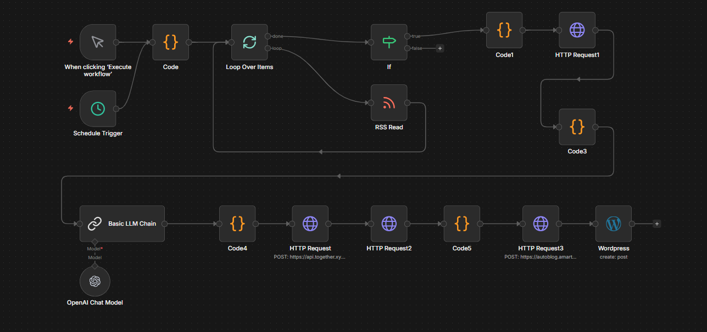

# Global RSS News → WordPress Automation (n8n)

An AI-powered content automation workflow built in n8n that fetches news from RSS feeds, filters and prioritizes articles, rewrites them using OpenAI, formats them into structured JSON, and automatically publishes them to WordPress.

---

## 📌 Overview

This project builds a fully automated AI news publishing pipeline using RSS feeds, OpenAI, and WordPress.

The workflow:

- Fetches articles from multiple RSS feeds  
- Filters articles based on defined conditions  
- Extracts full article content via HTTP scraping  
- Cleans and preprocesses raw HTML  
- Rewrites articles using OpenAI
- Generates image based on content
- Formats output into WordPress-compatible structured JSON  
- Publishes articles automatically to WordPress  

This automation can be scheduled or manually triggered and is designed for scalable AI-powered content publishing.

---

## 🏗️ Workflow Architecture

### Main Components

- Manual Trigger / Schedule Trigger  
- Code (RSS Source Initialization)  
- Loop Over Items  
- RSS Read  
- If Node (Filtering Logic)  
- Code (Article Formatting)  
- HTTP Request (Full Article Fetch)  
- Code (HTML Cleaning & Preprocessing)  
- Basic LLM Chain  
- OpenAI Chat Model  
- Code (WordPress JSON Formatter)  
- HTTP Requests (Image Genration & Upload)  
- WordPress Node (Create Post)

---

## 🔄 Workflow Visual



---

## 🧠 How It Works

### 1. RSS Collection
- Reads multiple RSS feeds  
- Loops through all items  
- Aggregates articles from different sources  

### 2. Filtering Logic
The `If` node filters:
- Based on recency  
- Based on custom conditions  
- (Can be extended to embedding similarity scoring)

Only selected high-priority articles move forward.

### 3. Full Article Extraction
- Uses HTTP Request node to fetch the full article content  
- Removes unnecessary HTML, scripts, and formatting noise  
- Prepares clean article text for AI processing  

### 4. AI Rewriting
The OpenAI Chat Model:
- Rewrites the article while preserving context  
- Improves structure and clarity  
- Adds enhanced narrative quality  
- Outputs structured Markdown-style content  

### 5. WordPress JSON Formatting

A dedicated Code node:
- Extracts the title from Markdown header  
- Converts content into HTML `<p>` format  
- Generates excerpt automatically  
- Structures final JSON object:

```json
{
  "title": "Generated Title",
  "content": "<p>Formatted HTML content</p>",
  "status": "publish",
  "categories": [1],
  "tags": ["AI", "News"],
  "excerpt": "Short summary"
}
```

### 6. Image Generation

- Generates an image based on the blog content.
- The prompt is received from the AI Agent node.

---

### 7. Auto Publishing

The WordPress node:
- Creates a new post  
- Sets status (publish/draft)  
- Assigns category IDs  
- Applies tags  
- Publishes automatically  

---

## 🛠️ Tech Stack

- n8n (Workflow Automation)  
- OpenAI Chat Model (LLM Rewriting)  
- RSS Feeds  
- HTTP Request (Content Scraping)  
- WordPress REST API  
- JavaScript (Data Transformation Nodes)  

---

## 🔐 Required Credentials

To run this workflow, configure the following in n8n:

- OpenAI API Key  
- WordPress Credentials (Application Password or OAuth)  
- RSS Feed URLs  

---

## ✅ Features

- Multi-source RSS aggregation  
- Article filtering logic  
- Full article scraping  
- AI-powered rewriting  
- Structured JSON formatting for CMS  
- Automated WordPress publishing  

---

## 🎯 Use Cases

- Automated news publishing website  
- AI-powered blog generation  
- Niche content aggregator  
- Content marketing automation  
- AI media demo project  
- Portfolio-level automation architecture  
